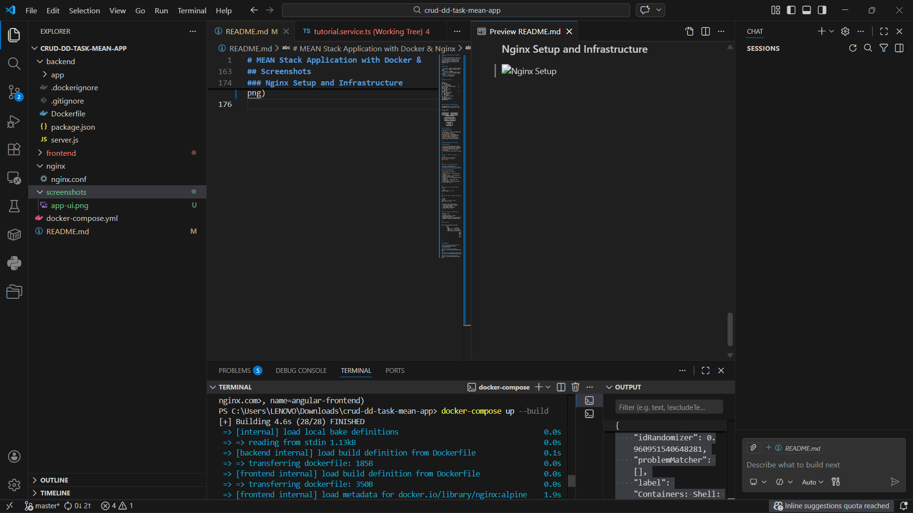
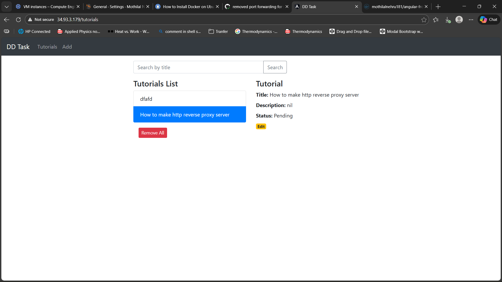
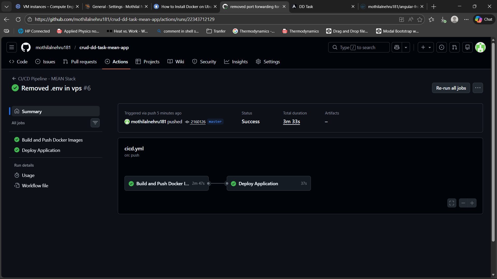

# MEAN Stack Application with Docker & Nginx

A full-stack CRUD application built with **MongoDB, Express, Angular, and Node.js**, containerized using Docker and served via Nginx as a reverse proxy. Includes a full CI/CD pipeline using GitHub Actions.

---

## Tech Stack

- **Frontend**: Angular (served by Nginx)
- **Backend**: Node.js + Express (port 8080)
- **Database**: MongoDB
- **Web Server**: Nginx (reverse proxy)
- **Containerization**: Docker & Docker Compose
- **CI/CD**: GitHub Actions
- **Registry**: Docker Hub

---

## Project Structure

```
project/
├── .github/
│   └── workflows/
│       └── cicd.yml               # GitHub Actions CI/CD pipeline
├── frontend/                      # Angular app
│   ├── Dockerfile
│   └── src/
├── backend/                       # Node.js + Express API
│   ├── Dockerfile
│   ├── server.js
│   └── config/
│       └── db.config.js
├── nginx/
│   └── nginx.conf
├── docker-compose.yml
└── README.md
```

 

## CI/CD Pipeline (GitHub Actions)

The pipeline has **4 jobs** that run automatically on every push to `master`:

```
Push to master
     │
     ▼
┌─────────────┐   ┌──────────────┐
│Test Backend │   │Test Frontend │
└──────┬──────┘   └──────┬───────┘
       └────────┬─────────┘
                ▼
     ┌──────────────────────┐
     │ Build & Push Docker  │
     │ Images to Docker Hub │
     └──────────┬───────────┘
                ▼
         ┌────────────┐
         │   Deploy   │
         │ to Server  │
         └────────────┘
```

### Job Breakdown

| Job | What it does |
|---|---|
| `test-backend` | Installs dependencies and runs Node.js tests |
| `test-frontend` | Installs dependencies and builds Angular app |
| `build-and-push` | Builds Docker images and pushes to Docker Hub |
| `deploy` | SSHs into server, pulls latest images, restarts containers |

---

## Setup & Deployment Instructions

### Prerequisites

- [Docker Desktop](https://www.docker.com/products/docker-desktop/) installed
- [Git](https://git-scm.com/) installed
- A [Docker Hub](https://hub.docker.com/) account
- A [GitHub](https://github.com/) account

---

### Step 1: Clone the repository

```bash
https://github.com/mothilalnehru181/crud-dd-task-mean-app
cd crud-dd-task-mean-app
```

---

### Step 2: Set up GitHub Secrets

Go to your GitHub repository → **Settings** → **Secrets and variables** → **Actions** → **New repository secret**

Add the following secrets:

| Secret Name | Description |
|---|---|
| `DOCKER_USERNAME` | Your Docker Hub username |
| `DOCKER_PASSWORD` | Your Docker Hub password or access token |
| `SERVER_HOST` | Your deployment server IP address |
| `SERVER_USER` | Your server SSH username (e.g., `ubuntu`) |
| `SERVER_SSH_KEY` | Your private SSH key for server access |


---

### Step 3: Run locally with Docker Compose

```bash
docker-compose up --build
```

---

### Step 4: Push to GitHub to trigger CI/CD

```bash
git add .
git commit -m "initial commit"
git push origin master
```

The pipeline will automatically:
1. Build Docker images
2. Push images to Docker Hub
3. Deploy to your server

---

### Step 5: Access the application

| Service | URL |
|---|---|
| crud-app | http://34.93.3.179/tutorials |

---

## How It Works

```
User → http://localhost (port 80)
            │
          Nginx
            ├── /          → Serves Angular app (static files)
            └── /api/      → Proxies to Node.js backend (port 8080)
                                        │
                                    MongoDB (port 27017)
```

---


## Screenshots

### Docker Image Build and Push


### Application Deployment and Working UI

### Application Deployment and Working UI

